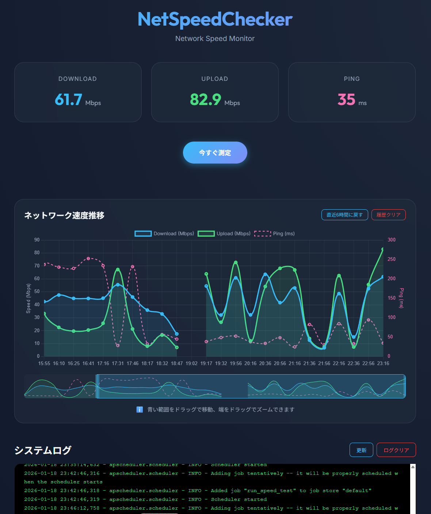

# NetSpeedChecker

[Japanese Version (日本語版)](README.md)



A network speed monitoring tool. Measures speed at regular intervals and provides a modern web dashboard to view history.

## Background
After switching to Nuro Hikari, I noticed occasional stuttering while using WiFi, which led to high latency or unexpected router reboots. Since contacting support didn't yield immediate results, I created this tool to periodically connect to the network and measure the speed to track stability.

## Features
- 🚀 **Automatic Measurement**: Automatically measures speed at specified intervals (Default: 20 minutes).
- 📊 **Visualization**: Real-time charts on the dashboard and historical charts for past trends.
- 📅 **History View**: Browse past measurement data by selecting a date from a calendar.
- 💎 **Modern UI**: Premium dark theme with glassmorphism design.
- 🐍 **Easy Setup**: Includes an installer for Raspberry Pi.

## Setup (Raspberry Pi / Linux)

```bash
# Clone or copy the directory, then move into it
cd netspeedchecker

# Grant execution permissions
chmod +x install.sh run.sh

# Install (First time only)
./install.sh

# Run
./run.sh
```

## Setup (Windows)

```powershell
.\setup_windows.ps1
.\run_windows.ps1
```

After starting, access `http://[RasPi-IP-Address]:8080` in your browser.

## Settings
You can adjust the measurement interval and server settings by changing constants in `config.py`.

```python
# config.py
CHECK_INTERVAL = {"minutes": 30}  # Example: every 30 minutes
PORT = 8080                       # Server port
```

## Tech Stack
- **Backend**: Python / FastAPI / APScheduler / SQLite
- **Frontend**: Vanilla JS / CSS / Chart.js
